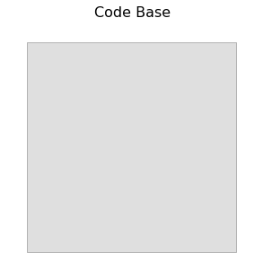
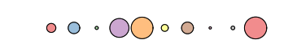
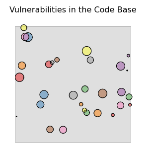
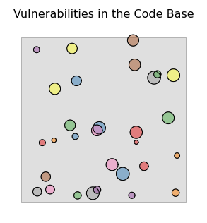

# circlesquare
Agent Modeling of Software Vulnerability Discovery

This repository catalogs models and analysis scripts for simulating the discovery of cyber vulnerabilities.
The model itself is designed as the simplest representation of the discovery process that treats both vulnerabilities
and their discoverers at an individual level

The Simplest Model of Vulnerability Discovery
Our model is built around four primary assumptions. The first assumption is that any piece of software 
has a finite ‘attack surface’ which represents the full range of ways that an outside actor can 
interact with the system. To create a visual metaphor we can represent this surface as a unit square. 
We can give an upper bound to this surface by noting that with a fixed baud rate and a finite amount of time, 
there are only so many bits that can be transmitted to the system. 

The second assumption follows from the first, and claims that if the attack surface 
represents all of the ways of interacting with the system, a vulnerability is an interaction 
with the system that compromises its integrity, availability, or confidentiality. 
In our visual metaphor, we draw this vulnerability as a circle within the unit square.

The third assumption is that the ease of discovery varies from vulnerability to vulnerability, 
and the relative difficulty is a function of the techniques used. We use larger circles to represent 
easy to find vulnerabilities, and smaller circles to represent those that are less likely to be discovered 
with current techniques.

Our last assumption is that the process of looking for vulnerabilities is one of trial and error, 
and that trials are conducted more or less randomly. To seek a vulnerability, we randomly select 
a point in our code base, and test if a vulnerability is present at that location. We become aware 
of any vulnerabilities that overlap with our given search point. For example, in the figure to the right,
the randomly chosen coordinates discover a single (red) vulnerability. This mimics the way in which a 
fuzzer might send pseudo-random inputs to the system based upon some knowledge of common flaws and weaknesses.

